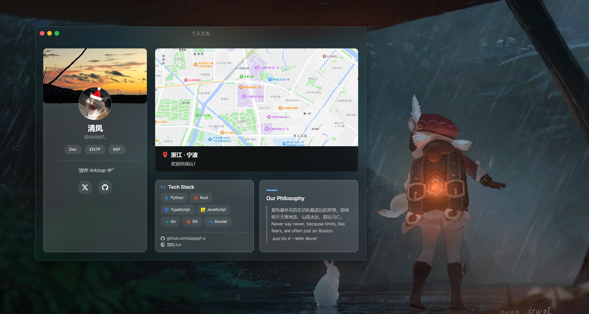

# PersonalCardDemo

这是一个个人 Card 生成软件。

你可以把它当成一张能运行的个人介绍卡。改一下名字、头像、封面、地图、技术栈和社交链接，程序就会把这些内容排成一页完整的展示界面。拿来做个人主页展示、作品页配图，或者直接打包发给别人看，都很合适。



## 它能做什么

- 用一份 `config.yaml` 管理你的个人信息和页面内容
- 支持 `fluent` 和 `glass` 两套展示风格
- 名字、签名、标签、地图、技术栈、链接都可以自己配
- 图片直接放在 `Assets/` 里替换，不用改程序
- 保存配置后会自动刷新，调起来比较顺手
- Windows、macOS、Linux 都能运行

## 适合谁用

- 想做一张本地可运行个人展示页的人
- 想做一个更完整电子名片的人
- 想快速换内容、换图片、换风格的人
- 想把自己的主页打成一个独立程序发给别人看的人

## 怎么开始

### 直接运行

下载 `PersonalCardDemo-win-x64.zip`，解压后直接运行 `PersonalCardDemo.exe` 即可。

### 改成你自己的内容

1. 打开 `config.yaml`
2. 把名字、签名、标签、链接这些内容换成你自己的
3. 如果要换图，就替换 `Assets/` 里的图片
4. 保存后看效果，不满意就继续改

## 配置示例

```yaml
style: glass
theme: dark

profile:
  name: 清风
  id: "@qqqqqf-q"
  signature: "创作 Arkloop 中"
  tags: [Dev, ENTP, MtF]
  cover_image: "Assets/cover.jpg"
  avatar_image: "Assets/avatar.png"

location:
  city: "浙江 · 宁波"
  description: "欢迎找我玩！"
  map_image: "Assets/map.png"
```

完整字段说明见 [`config.yaml`](./config.yaml)。

## 图片怎么换

程序会从 `Assets/` 目录读取图片。最常用的是这三张：

- 封面图：资料卡顶部横幅
- 头像：显示为圆形头像
- 地图图：位置卡片背景


```text
Assets/
  cover.jpg
  avatar.png
  map.png
```

## 技术实现

- 运行时：.NET 8
- 结构：组件化卡片模板与布局引擎
- 平台：Windows / macOS / Linux

## 运行与部署

### 本地运行

```bash
dotnet run
```

### 发布自包含 Windows 可执行文件

```bash
dotnet publish -c Release -r win-x64 --self-contained true -p:PublishSingleFile=true -p:IncludeNativeLibrariesForSelfExtract=true -p:EnableCompressionInSingleFile=true -o publish/win-x64
```

## 项目结构

```text
PersonalCardDemo/
  Components/   # 卡片模板
  Config/       # 配置加载、校验、迁移
  Layout/       # 布局引擎
  Styles/       # Fluent / Glass 样式资源
  ViewModels/   # 数据绑定
  Views/        # 主窗口与交互
  Assets/       # 图片资源
```

## License

MIT
